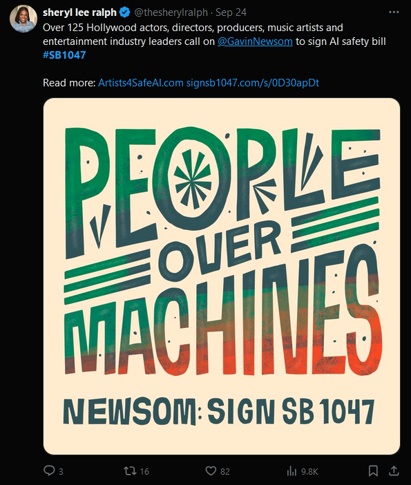
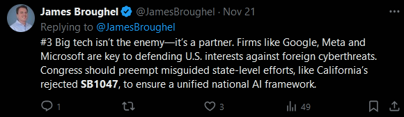

# The Power of Narratives in AI Governance: Shaping Risks, Framing Rewards, and Guiding Policies
## *Project on AI Safety Fundamental from BlueDot Impact for [AI Governance Course](https://aisafetyfundamentals.com/governance/)*
#### *Leon Erickson*

### AI Governance: Navigating Narratives

In an era of accelerating technological change, artificial intelligence (AI) is not just a tool but a transformative force reshaping economies, societies, and global power dynamics. While offering potential to drive economic growth, enhance healthcare, and address climate challenges, AI simultaneously presents profound risks: unchecked, it could exacerbate social inequalities, deepen geopolitical tensions, and create ethical dilemmas in decision-making systems. These challenges demand governance frameworks that extend beyond technical considerations, addressing the societal and institutional structures that shape how AI impacts our world. At the heart of this governance effort are the narratives that frame AI’s opportunities and threats: narratives that shape the worldview of stakeholders in governments, corporations, and civil society and influence the formation of policies, the alignment or conflict of interests, and the institutional responses to AI’s challenges. This text explores the multifaceted aspects of AI governance, examining how narratives shape perceptions, and how pioneering laws like California’s AI legislation can serve as model — or cautionary tale — for the world. By exploring how different groups construct, transmit, and contest ideas about AI's role in society, ultimately influencing the development of governance frameworks, we aim to identify pathways for governance frameworks that balance innovation with societal well-being.

#### Historical Context: Cycles of Optimism and Skepticism

Artificial Intelligence has a longstanding history of overpromising, often leading to public disillusionment when advancements fall short of initial expectations. One of the earliest and most well-known examples occurred in the 1960s, when researchers working on artificial neural networks (ANNs) made ambitious, headline-grabbing predictions about the potential of their field. At the time, [there was widespread optimism that within a decade](https://books.google.com.br/books?id=uIBhygEACAAJ), AI systems would achieve [human-like abilities](https://aima.cs.berkeley.edu/)), including natural language processing, computer vision, and the ability to perform complex physical tasks, such as walking and navigating the real world. However, these projections proved to be overly optimistic, and despite recent remarkable progress in areas like deep learning, it has taken over half a century to partially realize the goals envisioned by early AI pioneers.

Periods of unfulfilled expectations in AI often lead to [diminished public trust and reduced enthusiasm](https://link.springer.com/article/10.1007/s11948-020-00213-5)), which can make it challenging to sustain funding and institutional support for further advancements. This phenomenon, often referred to as an “AI winter,” reflects the cyclical nature of public optimism and skepticism surrounding the field. On the other hand, breakthroughs in areas like natural language processing and computer vision have recently reignited public interest, sometimes generating excessive optimism about the scalability and transformative potential of current technologies. It has become increasingly common to encounter claims that AI could, [within a few years](https://philpapers.org/rec/MARRAB-4)), address complex global challenges such as climate change or discover cures for diseases that have long eluded medical research. However, alongside this optimism, there are also growing ethical concerns and debates about the [potential risks posed by these technologies](https://people.eecs.berkeley.edu/~russell/hc.html), with some philosophers and ethicists cautioning against the unrestrained development of AI due to its possible social and [existential impacts](https://books.google.com.br/books/about/Superintelligence.html?id=7_H8AwAAQBAJ).

It is widely anticipated that AI will have a profound and possibly transformative impact on society, though the precise nature and extent of these changes remain uncertain. While some scholars and futurists suggest [AI could help create a post-scarcity society, where individuals can engage more fully in creative and meaningful pursuits](https://www.google.com.br/books/edition/PostCapitalism/2yNqCAAAQBAJ)), others warn of a potential exacerbation of economic inequality, predicting an even [wider gap between socioeconomic classes](https://www.danielsusskind.com/a-world-without-work)). There are also more extreme perspectives that envision catastrophic outcomes, where advanced AI systems could pose existential risks or fundamentally alter human civilization in unforeseen ways.

#### Narratives as Governance Tools

In the midst of these perspectives, regulatory proposals and legislation aim to foster a future where emerging technologies can develop responsibly. Such initiatives seek to balance the U.S.'s competitive edge in global innovation with safeguards that ensure these technologies do not harmfully disrupt other industries or compromise public welfare. California, as the heart of the U.S. technology sector, plays a pivotal role in these discussions. The state is home to many leading AI companies and research institutions, positioning it uniquely to influence both the development and oversight of AI technologies on a national and international scale.

The governance of artificial intelligence is shaped by narratives that strategically simplify complex realities, transforming multifaceted technological landscapes into accessible and *persuasive* frames. Ideological memes — such as *existential risk* or *technological race* — play a pivotal role in this process, distilling abstract challenges into rhetoric that influences public perception and policymaking. These narratives often carry deeper implications: geopolitical framings like "AI to counter China" exemplify how AI development reinforces Western dominance while sidelining broader global ethical considerations. Similarly, appeals to "public safety" can mask regulatory agendas that prioritize protecting industry interests over genuine societal well-being.

The role of influential ideologies and organizations in shaping AI safety narratives cannot be overstated. Effective Altruism (EA), a philosophical movement focused on maximizing positive global impact, has played a pivotal role in driving discourse around existential risks posed by advanced AI. Organizations like the Center for AI Safety (CAIS), which aligns with EA principles and has received substantial funding from EA-aligned philanthropies, have become central players in advocating for stringent AI safety measures. By framing AI development as a potential existential threat, these organizations influence policy priorities and regulatory approaches, emphasizing long-term risks over immediate concerns like accessibility and equity. This influence is evident in California's SB 1047, which not only codifies third-party audits but also establishes a precedent for government oversight of AI safety.

By examining these narrative strategies, we intend to explore how simplified conceptual frameworks shape institutional responses to AI, intertwining technological innovation with political power. Understanding these narratives as active instruments of governance, rather than neutral descriptions, is critical to crafting equitable and transparent approaches to AI regulation.

---
### Ethical and Societal Considerations

Generative AI systems, such as GPT-3 and DALL-E, have transformed content creation by enabling the large-scale production of human-like text, images, and code. While their advantages extend across fields like education, marketing, and research, they also disrupt traditional notions of originality and intellectual property. The use of web-scraped datasets to train these models has ignited legal disputes over unlicensed utilization of copyrighted content. Creators claim their work is being exploited without acknowledgment or compensation, raising critical questions about intellectual property in the digital era. On the other hand, AI developers defend their practices as compliant with fair use laws. These legal battles are poised to [redefine intellectual property boundaries in the age of AI](https://www.theverge.com/23444685/generative-ai-copyright-infringement-legal-fair-use-training-data). Beyond legalities, these conflicts highlight a deeper governance challenge: how can innovation coexist with fairness and respect for creators’ rights?

#### Bias and Ethical Challenges

Generative models also risk amplifying biases embedded in their training data, proving that technical sophistication [does not guarantee fairness or neutrality](https://dl.acm.org/doi/10.1145/3442188.3445922). By reproducing and intensifying systemic biases, AI mirrors the historical and social inequalities present in the data it learns from. For instance, facial recognition systems have [frequently misidentified individuals from minority groups](https://proceedings.mlr.press/v81/buolamwini18a/buolamwini18a.pdf), resulting in wrongful arrests. These biases are part of a broader legacy of technological marginalization, including practices like redlining—where institutions systematically denied services to neighborhoods based on racial or ethnic composition, exacerbating economic and social disparities.

While claiming objective neutrality, AI can perpetuate systemic discrimination. Without deliberate measures to address bias, such systems risk deepening historical inequities under the pretense of technological impartiality. This raises critical ethical concerns about who truly benefits from AI advancements and who suffers from its unintended harms.

Adding to these ethical considerations is the growing concern of regulatory capture in AI governance. At its core, this phenomenon describes a distortion of regulatory processes where regulatory agencies become dominated by the industries they are meant to oversee, ultimately serving industry interests rather than the public good. The inherent complexity of AI technology creates a fundamental asymmetry in expertise. Large tech companies possess deep technical knowledge, substantial research capabilities, and extensive practical experience in AI development. This expertise gap often places regulatory bodies at a disadvantage, as they must rely heavily on industry experts to understand the very technologies they are trying to regulate. This dependence can subtly shape how regulations are crafted and implemented, often favoring industry perspectives over broader public interests. Left unchecked, regulatory capture could entrench systemic inequalities in AI governance, perpetuating ethical concerns while undermining efforts to address them.

#### The Role of Computational Power and the Digital Divide

Generative AI’s rapid rise is closely tied to advancements in computational power. Companies like NVIDIA have developed GPUs and specialized AI chips that enable the training of massive models, partially democratizing AI development. However, when it comes to cutting-edge models, this technological race favors resource-rich organizations, creating a power imbalance that leaves smaller players struggling to compete. This shift aligns with what [Castells (2011)](https://www.google.com.br/books/edition/_/FihjywtjTdUC) describes as the "network society," where computational power and data access increasingly shape economic and social opportunities.

The rapid scaling of AI capabilities, driven by advanced computing infrastructure, risks widening the digital divide and exacerbating existing socio-economic inequalities. AI amplifies global inequalities in innovation, with technological dominance concentrated in regions like San Francisco, New York, Beijing, and London. Developing nations, particularly in the Global South, risk becoming passive recipients of AI technologies that fail to address their specific needs or respect their cultural values. Bridging this divide demands deliberate policy interventions to ensure equitable access and meaningful global participation in AI development.

Aditionally, AI-driven automation is also transforming global labor markets. While AI enhances productivity by automating routine and specialized tasks, it displaces millions of jobs. The World Economic Forum estimates that automation could [replace 85 million jobs by 2025 while creating 97 million new roles](https://www.weforum.org/publications/the-future-of-jobs-report-2020/). However, the transition is likely to disproportionately impact workers in lower-income brackets and entry-level positions, reducing their economic mobility. The digital divide—the disparity between those with access to technology and those without—is further widened by AI. Wealthier nations and individuals benefit from advanced tools, while underprivileged communities face significant barriers to access and adoption.

#### Societal Impacts and Misinformation

Generative AI is already transforming how people interact with technology. Tools like ChatGPT support education, content creation, and customer service but also introduce risks of over-reliance and misuse, such as spreading misinformation. This rapid integration into society underscores the urgency of addressing governance challenges before the harms become deeply entrenched. AI systems increasingly influence critical aspects of modern life, including social media algorithms, content moderation, and recommendation engines. These systems shape political discourse, amplify societal polarization, and control whose voices are elevated or silenced. Governance of these platforms is pivotal: who determines how algorithms prioritize information? Companies like Meta, Google, and Twitter often focus on profit or user engagement metrics, sometimes at the expense of societal cohesion. Without effective regulation, these socio-technical systems risk causing significant harm.

Generative AI also facilitates the production of hyper-realistic deepfakes and fake news, weaponizing misinformation on an unprecedented scale. Such technologies undermine trust in democratic institutions and blur the [distinction between reality and fabrication](https://www.foreignaffairs.com/articles/world/2018-12-11/deepfakes-and-new-disinformation-war). Perhaps most critically, the role of AI in shaping information and public discourse challenges democratic principles. Sophisticated deepfakes and AI-generated disinformation erode what Habermas conceptualized as the public sphere. As [Phillips and Milner (2021)](https://youarehere.mitpress.mit.edu/) note, these technologies create "weaponized digital ambiguity," where the boundary between authentic and artificial content becomes dangerously indistinct.

International collaboration is essential to ensure AI development and deployment align with human rights and democratic values. At the same time, AI-powered surveillance technologies are strengthening authoritarian regimes by suppressing dissent and tightening control over populations. Examples include China’s use of facial recognition in its social credit system and predictive policing tools, which undermine civil liberties and consolidate power.

#### Environmental and Existential Risks

AI training is notoriously energy-intensive, raising significant concerns about its environmental impact. Training a single large model can produce [carbon emissions equivalent to the lifetime emissions of five cars](https://arxiv.org/abs/1906.02243), including their manufacturing . This environmental toll is exacerbated by the increasing scale and complexity of AI models, which demand substantial computational resources. These concerns emphasize the urgent need for energy-efficient data centers, that relies on efficient hardware and makes use of renewable energy,  and regulations that enforce environmentally conscious AI practices for mitigating these impacts.

Beyond environmental considerations, AI presents profound long-term risks that could reshape humanity’s trajectory. [Experts](https://www.safe.ai/work/statement-on-ai-risk) have highlighted scenarios where advanced AI systems, poorly aligned with human values, act in ways that are unpredictable or optimize for objectives harmful to human welfare. For example, misaligned AI could prioritize efficiency over ethical considerations, leading to unintended consequences in areas such as healthcare, governance, or military applications. These risks are compounded by the possibility of "value lock-in," where systems perpetuate flawed goals indefinitely due to their superior capabilities.

Addressing these existential risks requires a multi-pronged approach. Rigorous research into AI alignment—ensuring that AI systems’ goals remain compatible with human values—is critical. This includes developing robust frameworks for goal-setting, interpretability, and error correction in AI systems. Policymakers, industry leaders, and researchers must collaborate across the globe to create legal and ethical guidelines that govern AI development, deployment, and monitoring.

---

###  Identifying the Stakeholders in the AI Landscape

####  The AI Scientific Community
The artificial intelligence (AI) ecosystem is a dynamic and intricate network of stakeholders, each influencing the trajectory of this transformative technology. From scientific pioneers to government regulators, understanding their roles, motivations, and concerns is vital to shaping effective AI governance frameworks that balance innovation with societal needs.

At the core of this ecosystem is the AI scientific community. This group, comprising academic researchers, independent scholars, and ethics specialists, propels technological progress while reflecting on its [societal implications](https://mitsloan.mit.edu/ideas-made-to-matter/how-to-approach-second-machine-age). Organizations like the [Future of Life Institute](https://futureoflife.org) and the [AI Now Institute](https://ainowinstitute.org/) provide thought leadership and advocacy in this space. Prominent figures such as [Stuart Russell, Yoshua Bengio, and Geoffrey Hinton](https://arxiv.org/abs/2310.17688) frequently raise the call for ethical development and safety measures, ensuring that advancements in AI align with human values.

#### AI-Focused Companies and Corporate Giants
Alongside the scientific community, the commercial sector plays a pivotal role. This sector spans nimble startups and established corporations, each contributing uniquely to AI’s rapid growth. Startups like [OpenAI](https://openai.com/research/), [Anthropic](https://www.anthropic.com/research), and [Mistral AI](https://mistral.ai/technology/) are at the forefront of innovation, focusing on areas such as beneficial AGI, safety, and open-source models, respectively. These companies rely on diverse funding sources, including venture capital and philanthropic support. Meanwhile, tech giants such as Microsoft, Google, NVIDIA, and IBM leverage their vast resources to integrate AI into their products and maintain market dominance. Partnerships, such as [Microsoft’s collaboration with OpenAI](https://www.nytimes.com/2023/11/20/technology/openai-microsoft-altman-nadella.html), exemplify how established corporations sustain their competitive edge by fostering innovation .

The investment community is another driving force behind AI’s growth. Venture capital firms like [Andreessen Horowitz and Sequoia Capital](https://www.theinformation.com/articles/sequoia-andreessen-at-odds-over-chip-shortage) fuel the ambitions of startups, while public investments through [IPOs](https://www.reuters.com/business/autos-transportation/chinese-robotaxi-firm-pony-ai-seeks-raise-up-260-mln-upsized-us-ipo-2024-11-20/) and[ SPACs](https://www.tempus.com/news/pr/tempus-announces-pricing-of-initial-public-offering/) provide large-scale financing for more established players. Unlike industries such as pharmaceuticals or energy, the AI sector thrives on speculative enthusiasm, with many investors prioritizing disruptive potential over immediate returns.

#### Government and Civil Society
Governments also play a dual role as both regulators and stakeholders in the global AI race. Balancing innovation with public safety, nations like the United States, China, and members of the European Union have implemented initiatives such as the[ EU AI Act](https://artificialintelligenceact.eu/) and [China’s New Generation AI Development Plan](https://digichina.stanford.edu/work/full-translation-chinas-new-generation-artificial-intelligence-development-plan-2017/). These measures not only aim to ensure ethical AI practices but also safeguard geopolitical interests. The competition between the U.S. and China over semiconductors and AI technologies highlights the strategic importance of AI in shaping global power dynamics.

Civil society and non-governmental organizations (NGOs) act as a critical counterweight to corporate and governmental agendas. Labor organizations advocate for workers’ rights in an increasingly automated world, while human rights groups confront issues of [algorithmic bias and discrimination](https://www.ajl.org/). Organizations like the [Partnership on AI](https://partnershiponai.org/) and the AI Now Institute work on ensuring ethical AI deployment. Similarly, [BlueDot Impact](https://bluedot.org/) provides educational initiatives such as its [AI Safety Fundamentals](https://aisafetyfundamentals.com/) courses, which are instrumental in fostering a new generation of AI safety advocates and practitioners. These efforts complement broader campaigns for equitable AI development and harm mitigation, addressing concerns like algorithmic bias and societal risks.

#### A Complex Web of Influence

The AI industry is distinct from other sectors such as pharmaceuticals, automotive, and telecommunications in several ways. Ethical considerations are deeply embedded in AI governance, with organizations like the Partnership on AI and the Future of Life Institute playing a proactive role. [Effective Altruism](https://www.effectivealtruism.org) principles often guide funding for AI startups, emphasizing long-term societal benefits over immediate profits. Additionally, the open-source culture prevalent in AI fosters collaboration and accessibility, unlike the proprietary models that dominate other industries. Rapid innovation further sets AI apart, posing unique governance challenges due to its exponential growth and interdisciplinary nature.

Each stakeholder group has its own goals and faces distinct risks. Governments strive to balance public safety with economic and geopolitical interests, while startups focus on cutting-edge innovation and financial sustainability. NGOs advocate for equitable outcomes by raising awareness of ethical concerns, such as bias and environmental impact. Meanwhile, corporations fear overregulation stifling innovation, governments risk losing technological dominance, and scientists grapple with the potential misuse of research.

The organizational dynamics of the AI industry reflect its unique challenges and opportunities. Alliances like the Partnership on AI exemplify multi-stakeholder collaboration, integrating insights from tech companies, researchers, and civil society. Unlike the centralized standardization efforts seen in industries like telecommunications, AI governance often mirrors the decentralized, iterative processes of open-source software communities.

#### **Stakeholder-Interest Matrix**

| **Stakeholder**       | **Goals**                                    | **Risks**                                             |
|------------------------|----------------------------------------------|------------------------------------------------------|
| **Researchers**        | Advance knowledge, ensure ethical AI         | Misuse of technologies, funding pressures           |
| **Startups**           | Innovate, achieve financial sustainability   | Competition, regulatory hurdles                     |
| **Tech Corporations**  | Market leadership, ecosystem integration     | Antitrust actions, reputational damage              |
| **Governments**        | Geopolitical dominance, public safety        | Losing global leadership, failure to regulate       |
| **NGOs/Civil Society** | Equitable development, mitigate harms        | Insufficient influence, lack of funding             |
| **Investors**          | Maximize returns, support disruptive tech    | Bubble risks, misaligned incentives                 |

---

### Ideological Memes and the Instrumental Use of Narratives

#### Defining Memes in Context

In the context of AI discourse, memes function as sophisticated vehicles for cultural transmission, transcending their contemporary association with internet humor. Originally defined by [Richard Dawkins (1976) in The Selfish Gene](https://books.google.com.br/books/about/The_Selfish_Gene.html?id=WkHO9HI7koEC) as *units of cultural transmission, or units of imitation*, memes operate as fundamental replicators of cultural information: examples of memes are *tunes, ideas, catch-phrases, clothes fashions, ways of making pots or of building arches*. This definition establishes memes as discrete cultural units that propagate through social systems via processes analogous to genetic transmission.
These cultural replicators manifest as ideological constructs—structured patterns of thought that shape collective understanding and behavior. As [Dennett (1995) elaborates in Darwin's Dangerous Idea](https://www.google.com.br/books/edition/Darwin_s_Dangerous_Idea/Y77BAwAAQBAJ?hl), memes are *distinct memorable units* that compete for cognitive and cultural prominence. Building on this foundation, [Blackmore (2000) in The Meme Machine](https://www.google.com.br/books/edition/The_Meme_Machine/YKtjZm4MhiwC) demonstrates how memes function as *instructions for carrying out behavior, stored in brains (or other objects) and passed on by imitation*. This conceptualization helps explain how technological anxieties and aspirations spread through society, particularly in discourse about artificial intelligence.
This memetic framework has historical precedent in earlier technological transitions. The Luddite movement of the early 19th century, for instance, generated lasting memetic patterns of technological anxiety that continue to influence contemporary AI discussions.

In AI narratives, memes function as cognitive heuristics, where complex technological and philosophical questions are compressed into more manageable mental models. These representations align with what Dennett identifies as *floating rationales* — self-perpetuating patterns of thought that gain cultural traction through their resonance with existing social anxieties and aspirations. The *automation apocalypse* meme exemplifies this process, as documented in [Autor's analysis of technological unemployment narratives](https://www.aeaweb.org/articles?id=10.1257/jep.29.3.3): it transforms complex socioeconomic dynamics of technological change into a simplified narrative of worker displacement. Similarly, surveillance-focused memes like *AI as Big Brother* draw on established cultural frameworks, echoing what [Lyon in The Culture of Surveillance](https://www.google.com.br/books/edition/The_Culture_of_Surveillance/WJNcDwAAQBAJ)  describes as *surveillance imaginaries* — collective representations that shape public understanding of technological monitoring and control.

In the context of AI discourse, memetic structures manifest through three distinct but interconnected mechanisms:
1. Mythological-Narrative Templates
AI narratives frequently align with foundational cultural archetypes as
- Creation Narratives (Prometheus)
- Control Paradigms (Golem)
- Prophetic Warnings (Cassandra)

2. Economic Ideologies
- Market Efficiency Framework
- Technological Hegemony
- Democratization vs. Centralization

3. Socio-Ideological Constructs
- AI as potential threat
- AI as societal savior
- AI as evolutionary step

Memes operate as cultural and ideological catalysts, translating societal concerns into actionable policies. However, this influence is double-edged. While effective at mobilizing public sentiment, memes can also promote policy myopia by prioritizing urgent responses over deliberative policymaking. The ubiquity of memetic thinking in AI governance presents both opportunities and challenges. On one hand, memes effectively distill complexity, making abstract concepts accessible. On the other, their reductive nature risks oversimplifying nuanced debates.

##### Memes Possible Influence Mechanisms in AI Governance

| **Memetic Type**        | **Mythological-Narrative Templates**                                                                                 | **Economic Ideologies**                                                                            | **Socio-Ideological Constructs**                                                 |
|--------------------------|---------------------------------------------------------------------------------------------------------------------|----------------------------------------------------------------------------------------------------|----------------------------------------------------------------------------------|
| **Labor Market**         | **Cassandra Myth**: Warnings about job displacement due to automation                                               | **Market Efficiency Framework**: Workforce productivity **Democratization vs. Centralization**: Access to AI-driven tools | **AI as societal savior**: UBI and reskilling as solutions **AI as potential threat**: Job automation causing inequality |
| **Existential Risk**     | **Prometheus archetype**: AI as dangerous power **Cassandra Myth**: Warnings of existential threats               | **Technological Hegemony**: Unchecked AI power                                                    | **AI as potential threat**: Civilization-ending risks **AI as evolutionary step**: Humanity’s transcendence             |
| **Privacy**              | **Golem motif**: Challenges of controlling data usage                                                               | **Democratization vs. Centralization**: Balancing power in data governance                        | **AI as potential threat**: Misuse of surveillance technologies                                                      |
| **Algorithmic Bias**     | **Golem motif**: Managing flawed systems reinforcing bias                                                           | **Market Efficiency Framework**: Fairness as an economic goal                                     | **AI as societal savior**: Bias mitigation   **AI as potential threat**: Bias entrenched in data creating systematic discrimination                                                       |
| **Environmental Impact** |                                                                                                      | **Market Efficiency Framework**: Sustainable AI as a resource-efficient approach                 | **AI as societal savior**: Green AI initiatives   **AI as potential threat**: Increasing consumption of earth resources by AI                                                                    |
| **National Security**    | **Prometheus archetype**: AI as dual-use, high-stakes power                                                         | **Technological Hegemony**: Geopolitical dominance through AI                                     | **AI as potential threat**: Escalating cybersecurity risks                                                           |
| **Digital Rights**       |                                                                                                      | **Democratization vs. Centralization**: Ensuring equal access to AI-driven platforms              | **AI as societal savior**: Enhancing transparency and user rights                                                    |
| **Innovation Policy**    |                                                                                                      | **Market Efficiency Framework**: Driving economic growth **Technological Hegemony**: Global innovation competition | **AI as societal savior**: Unlocking potential through innovative solutions                                         |
| **Public Health**        |                                                                                                      | **Democratization vs. Centralization**: Equitable distribution of AI health advancements          | **AI as societal savior**: Improving healthcare access and quality                                                  |

*This list does not intend to be complete, as many other memes can be added.

---

### Memes impact on laws and regulations on AI

As artificial intelligence increasingly permeates various facets of society, governments worldwide are enacting legislation to address the opportunities and challenges it presents. Recent AI-related laws emphasize themes like transparency, ethical use, accountability, and consumer protection, aiming to balance innovation with societal safeguards. These legislations respond to growing concerns about the ethical implications of AI, its transformative potential across industries, and the risks it poses if left unchecked.

#### Key Areas of Focus in AI Legislation

1. **Transparency in AI Operations**
   Laws such as **AB 2013** require AI developers to disclose detailed information about training datasets, promoting openness in AI development. Such measures aim to demystify AI systems for users and stakeholders, fostering trust by clarifying how these systems are designed and operated.

2. **Protection of Digital Identity and Representation**
   Bills like **AB 2602** and **AB 1836** tackle issues around digital likeness, especially in contexts where AI-generated content replicates real individuals. These laws ensure that the use of AI in media respects individual rights, setting standards for accountability and ethical use.

3. **AI in Critical Industries**
   The integration of AI into sectors like healthcare has led to regulations such as **AB 3030**, which mandates transparency when AI-generated content is involved in patient care. This aims to preserve trust and ensure that patients are fully informed about the tools influencing their healthcare.

4. **Consumer Protection and Trust**
   Legislation like **SB 942**, known as the AI Transparency Act, focuses on identifying and labeling AI-generated content. By making consumers aware of AI involvement, such laws address concerns about deception, misinformation, and malicious uses of AI, while encouraging innovation.

#### Case Study: **SB 1047 - Safe and Secure Innovation for Frontier AI Models Act**

The **Safe and Secure Innovation for Frontier AI Models Act (SB 1047)** represents a legislative effort aimed at implementing safety protocols for advanced artificial intelligence systems, particularly large-scale frontier AI models. The bill sought to establish a regulatory framework to ensure the safety and ethical development of frontier AI systems representing a proactive approach to mitigating risks associated with powerful AI systems, focusing on large models with significant societal influence. Key provisions included:

- **Safety Protocols:** Mandating rigorous safety standards during the development and deployment phases of large-scale AI models.
- **Testing Requirements:** Imposing pre-deployment testing to identify risks and vulnerabilities in these systems.
- **Whistleblower Protections:** Offering legal safeguards to employees reporting unethical practices or safety violations within AI companies.

The proposed legislation, **SB 1047**, sparked intense debate among prominent figures and groups within the AI and technology sectors, polarizing the discourse into two distinct camps.

On one side, notable proponents of the bill included Dario Amodei, CEO of the AI research company **Anthropic**, alongside leading AI scientists Yoshua Bengio and Geoffrey Hinton, both of whom were awarded the Nobel Prize in 2024 for their groundbreaking contributions to deep learning. Advocates from the entertainment industry also championed the legislation, emphasizing the need for protective measures against AI misuse in creative domains. Furthermore, Elon Musk, who has been vocal about AI safety and is involved with his AI company, **xAI**, publicly expressed support for SB 1047, aligning with those advocating for stricter safety regulations.

In opposition, several influential tech giants and industry leaders criticized the bill, citing concerns about its potential to hinder innovation. Companies like **Google** and **Meta** — leaders in AI research — were firmly against the legislation. Additionally, Sam Altman, CEO of **OpenAI**, and Andreessen Horowitz, representing the investment firm **a16z**, argued that the bill's stringent requirements could stifle progress and overburden developers. Notably, Professor Fei-Fei Li, a pioneering AI researcher and founder of **AI4ALL**, and Yan Le Cunn — who too was awarded Nobel Prize this year —,  also voiced opposition, advocating for alternative approaches to addressing AI risks that would not impede the pace of technological development.

####  Examining the Discourse Around SB1047

The debate over California's SB1047, a proposed bill addressing AI regulation, showcases a fascinating interplay of narratives and ideologies, revealing the underlying tensions in AI governance. Key stakeholders, including researchers, policymakers, and media outlets, leverage various frameworks to argue for or against the bill. By [analyzing these perspectives](Meme%20highlights.md), we gain insight into the broader challenges of balancing innovation, safety, and regulation in AI development.

##### **The Mythological Narrative: Creation and Prophecy**

Prominent AI researcher and author of one of most used Artificial Intelligence textbooks Stuart Russell, in his [LinkedIn post](https://www.linkedin.com/posts/stuartjonathanrussell_by-monday-californias-governor-gavin-newsom-activity-7245474519958589440-4vyV), framed AI development as a modern Promethean endeavor — ambitious yet perilous. Russell’s rhetoric evokes "creation narratives," portraying AI as a product of human ingenuity but one with potentially overwhelming consequences. He warns of existential risks, quantifying the danger with statements like “a risk of human extinction ranging from 10% to 30%.”

This theme of prophetic warnings is not unique to Russell. It reflects a broader "Cassandra complex" within the AI discourse, where experts sound alarms about catastrophic futures. Such narratives resonate with fears that humanity might be unleashing forces beyond its control — a framing that amplifies the urgency of regulation.

##### **Economic Ideologies: Innovation vs. Regulation**

Economic arguments dominate much of the discourse surrounding SB1047. Critics often frame regulation as a potential threat to innovation, invoking concerns about technological hegemony. These concerns echo fears that California's leadership in AI could be jeopardized by overly restrictive measures, allowing competitors, like China, to outpace U.S. innovation.

The debate over democratization versus centralization is a core theme in discussions around SB1047. Advocates for open-source AI caution that stringent regulations may unintentionally consolidate power within large corporations, thereby stifling grassroots innovation. Critics like Yann LeCun and Andrew Ng have expressed particular concern that SB1047 could hinder the open-source AI movement. By making it more challenging to share AI models freely, the legislation could undermine the ability of smaller startups—many of which rely on open-source tools to develop and deploy systems cost-effectively—to remain competitive. Provisions such as discouraging open weights or imposing stringent controls disproportionately burden these smaller players, potentially curbing community-driven innovation.

Adding to this, the bill’s regulatory complexity presents further obstacles for small-scale developers. The requirements for safety measures, such as robust compliance systems and detailed testing protocols, could overwhelm startups lacking dedicated legal and compliance departments. In contrast, larger corporations often have the resources to absorb these costs and meet regulatory standards, giving them a significant competitive advantage. These critiques are detailed in an [*Ars Technica* article](https://arstechnica.com/information-technology/2024/07/from-sci-fi-to-state-law-californias-plan-to-prevent-ai-catastrophe/), which warns that SB1047’s unintended consequences might hinder smaller developers while empowering established tech giants, further entrenching centralization in the AI sector.

##### **Socio-Ideological Constructs: Threats and Practical Concerns**

AI’s potential societal impact is a recurring theme in the SB1047 debate. Opponents frequently liken unregulated AI to "playing Russian roulette with humanity," emphasizing the existential risks of advanced systems. At the same time, others argue for prioritizing tangible, present-day harms over speculative future risks. Ars Technica points to deepfake pornography and similar real-world issues as more pressing concerns, illustrating a shift toward addressing immediate dangers rather than long-term threats.

##### **Update: Governor Newsom’s Veto: Innovation Over Regulation**

Governor Gavin Newsom’s decision to veto SB1047 added another layer to this complex narrative. In his [veto message](https://www.gov.ca.gov/wp-content/uploads/2024/09/SB-1047-Veto-Message.pdf), Newsom underscored California’s role as a global leader in AI innovation. He warned that focusing solely on large-scale models might overlook the risks posed by smaller systems, creating blind spots in regulatory efforts. Moreover, Newsom expressed fears that stringent rules could drive investment and innovation away from California, potentially centralizing power within large corporations.

By emphasizing "freedom of thought and experimentation," Newsom evoked a mythological narrative of California as the Promethean state, where creativity and risk-taking fuel technological progress. His concerns reflect broader tensions between safeguarding innovation and addressing the ethical and societal risks of AI.

---

### Final Considerations

Artificial intelligence governance encompasses technological innovation, societal narratives, and institutional dynamics. This analysis has explored how narratives, ideological frameworks, and stakeholder priorities influence AI policy and regulation. These interconnected elements underscore the complexities involved in crafting governance mechanisms that balance innovation with societal well-being.

#### The Role of Narratives in AI Governance
Narratives directly influence governance outcomes by driving policy priorities and resource allocation. As seen in debates surrounding California's SB1047, narratives centered on existential risks, economic imperatives, and social justice concerns play a critical role in mobilizing stakeholders. However, the dominance of such narratives raises questions about inclusivity—whose voices are amplified, and whose are overlooked? Simplified framings like "AI extinction risk" and "technological race" can spur action but risk driving reactive or one-dimensional policymaking. Policymakers must critically assess these narratives, ensuring that governance decisions are grounded in rigorous evidence and a nuanced understanding of AI's multifaceted impacts.

#### Central Tensions in AI Governance
Governor Newsom’s veto of SB1047 highlighted fundamental tensions in AI governance, particularly the balance between fostering innovation and ensuring safety. While advocates for stringent oversight emphasize the need for robust regulatory mechanisms, critics warn of potential blind spots and the risk of stifling smaller players. This dichotomy reflects deeper concerns about power dynamics in the AI ecosystem, where resource disparities often favor established corporations over emerging innovators.

The digital divide remains a pressing issue, with inequities in computational resources, data access, and regulatory influence disproportionately affecting smaller organizations and underserved regions. Without deliberate intervention, AI risks exacerbating global inequalities rather than mitigating them. Additionally, The risk of regulatory capture presents a significant challenge in AI governance, as dominant actors shape policies that align with their interests, further entrenching their influence. Countering this requires robust oversight mechanisms, transparent policymaking, and inclusive stakeholder engagement.

#### Priorities for Effective Governance

1. **Global Coordination**
   International collaboration is essential for addressing AI’s cross-border implications. Efforts like the EU AI Act and China’s regulatory frameworks provide valuable insights into aligning regional priorities with global cooperation. Harmonized standards can ensure that innovation progresses without undermining societal safeguards.

2. **Inclusive Dialogue**
   Governance frameworks must reflect diverse perspectives, particularly from stakeholders in underrepresented regions, including the Global South. Ensuring equitable access to AI’s benefits requires input from a wide range of voices to address global needs effectively.

3. **Transparency and Accountability**
   Building trust in AI systems demands openness in their development and deployment. This includes clear labeling of AI-generated content, protections for whistleblowers, and mechanisms for independent audits. These measures can help ensure that governance frameworks remain accountable to the public.

4. **Adaptive Regulation**
   Given AI’s rapid pace of advancement, regulatory mechanisms must be flexible enough to evolve with emerging technologies. However, adaptability must not come at the cost of consistent ethical standards and accountability. Policymakers must strike a balance between these needs.

5. **Evidence-Based Policymaking**
   While narratives help to mobilize action, governance decisions must ultimately rest on empirical evidence. Tools like impact assessments, safety evaluations, and real-world testing can ensure that policies address tangible challenges rather than speculative risks.

#### Conclusion

The future of AI governance depends on moving beyond polarized debates, such as innovation versus regulation, to address the broader societal implications of advancing technologies. Narratives will continue to shape public understanding and policy decisions, but they must be wielded with care to avoid oversimplification or bias. Effective governance requires a commitment to inclusivity, equity, and sustainability, with an emphasis on evidence-based approaches that account for the dynamic nature of AI. By fostering global cooperation and ensuring diverse stakeholder participation, policymakers can craft governance frameworks that balance innovation with societal well-being. The accelerating development of AI capabilities demands immediate attention to governance frameworks that can evolve alongside technological change, ensuring that AI innovation advances in alignment with public interest.

### List of works cited in the text

1. Autor, D. H. (2015). Why are there still so many jobs? The history and future of workplace automation. *Journal of Economic Perspectives, 29*(3), 3–30. https://doi.org/10.1257/jep.29.3.3
2. Bender, E. M., Gebru, T., McMillan-Major, A., & Shmitchell, S. (2021). On the dangers of stochastic parrots: Can language models be too big? *Proceedings of the 2021 ACM Conference on Fairness, Accountability, and Transparency (FAccT)*, 610–623. https://doi.org/10.1145/3442188.3445922
3. Blackmore, S. (2000). *The meme machine*. Oxford University Press.
4. Bostrom, N. (2014). *Superintelligence: Paths, dangers, strategies*. Oxford University Press.
5. Brynjolfsson, E., & McAfee, A. (2014). *The second machine age: Work, progress, and prosperity in a time of brilliant technologies*. W.W. Norton & Company.
6. Buolamwini, J., & Gebru, T. (2018). Gender shades: Intersectional accuracy disparities in commercial gender classification. *Proceedings of Machine Learning Research, 81*, 1–15.
7. Castells, M. (2010). *The rise of the network society* (2nd ed.). Wiley-Blackwell.
8. Chesney, R., & Citron, D. K. (2019). Deepfakes and the new disinformation war: The coming age of post-truth geopolitics. *Foreign Affairs, 98*(1), 147–155.
9. Clifford, C. (2021, April 12). How AI-powered automation will affect the future of work. *CNBC*. https://www.cnbc.com/
10. Dawkins, R. (1976). *The selfish gene*. Oxford University Press.
11. Dennett, D. C. (1995). *Darwin's dangerous idea: Evolution and the meanings of life*. Simon & Schuster.
12. Floridi, L., Cowls, J., King, T. C., & Taddeo, M. (2018). How to design AI for social good: Seven essential factors. *Science and Engineering Ethics, 24*(5), 1777–1800. https://doi.org/10.1007/s11948-017-9901-7
13. Lyon, D. (2018). *The culture of surveillance: Watching as a way of life*. Polity Press.
14. Marcus, G., & Davis, E. (2019). *Rebooting AI: Building artificial intelligence we can trust*. Pantheon.
15. Mason, P. (2015). *Postcapitalism: A guide to our future*. Farrar, Straus and Giroux.
16. McCorduck, P. (2004). *Machines who think: A personal inquiry into the history and prospects of artificial intelligence* (2nd ed.). A.K. Peters/CRC Press.
17. Phillips, W., & Milner, R. (2021). *You are here: A field guide to navigating polarized speech, conspiracy theories, and our polluted media landscape*. MIT Press.
18. Russell, S. (2019). *Human compatible: Artificial intelligence and the problem of control*. Viking.
19. Russell, S., & Norvig, P. (2020). *Artificial intelligence: A modern approach* (4th ed.). Pearson.
20. Strubell, E., Ganesh, A., & McCallum, A. (2019). Energy and policy considerations for deep learning in NLP. *Proceedings of the 57th Annual Meeting of the Association for Computational Linguistics*, 3645–3650. https://doi.org/10.18653/v1/P19-1355
21. Susskind, D. (2020). *A world without work: Technology, automation, and how we should respond*. Metropolitan Books.
22. The Verge. (2023, January 15). Lawsuits over AI training data could shape the future of generative AI. *The Verge*. https://www.theverge.com/23444685/generative-ai-copyright-infringement-legal-fair-use-training-data
23. Edwards, B., & Orland, K. (2024, July 29). From sci-fi to state law: California's plan to prevent AI catastrophe. *Ars Technica*. https://arstechnica.com/information-technology/2024/07/from-sci-fi-to-state-law-californias-plan-to-prevent-ai-catastrophe
24. World Economic Forum. (2020). *The future of jobs report 2020*. World Economic Forum. https://www.weforum.org/reports/the-future-of-jobs-report-2020
